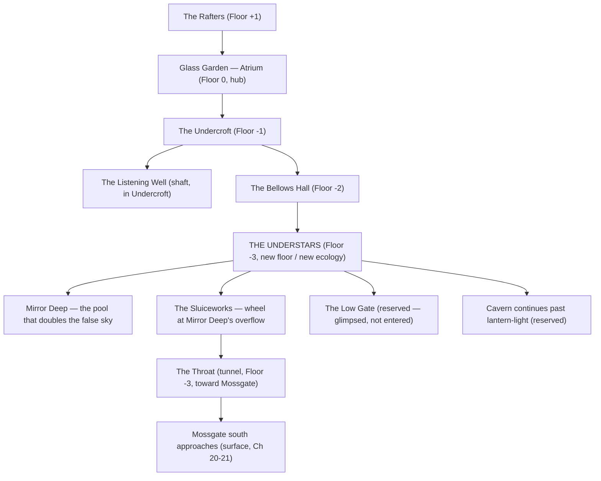

# Glass Garden — floors and rooms (Vol 1, Ch 16–21)

The Glass Garden (Ch 12–13) stops being one room and becomes a **hub**. It opens into distinct chambers above and below the main dome — a real dungeon of floors, not one biome looped twice — climaxing in a full new floor with its own ecology (the Understars) that proves the basin holds more than anyone mapped. Writer-only true name for the Garden: **First Conservatory**. Never on-page in Vol 1.

Natural Law reminder: floors cannot overlap; teleportation cannot cross floor/seam boundaries (`lore/natural-laws.md`). Every room below is reached by walking/climbing/descending, in sequence — no shortcuts.

## Floor map

## Rooms — upper and mid floors

### The Rafters — Floor +1 (Ch 16)

**Wonder (one line):** Glass catwalks laced through the dome's own treetops, hung with sealed cocoons that glow like lanterns nobody lit.

**Function:** Dormant vein-moth / pollinator stock, still cased. A lever, not a weapon — releasing them later (Ch 21) helps the moss recover and gives the beetle bloom something else to do.

**Entered/reserved:** Entered Ch 16. Party takes note of the cocoons; doesn't disturb them until Ch 21.

**Jester:** "Roofs have floors too, you know." Aside, already walking off. Not teaching.

### The Undercroft — Floor -1 (Ch 16–17)

**Wonder (one line):** Root scaffolding thick as ship ribs, holding the whole glass roof up from underneath.

**Function:** Physical evidence deepening Q-V1-smooth — the same fresh, pale root fibers as the Ancient Quarry (Ch 6), now inside a ruin instead of a cut stone. Niko notices; still doesn't prove. Also the cistern head: the point where the Garden's water used to split outward into the basin before something stopped sharing.

**Entered/reserved:** Entered and worked in Ch 16–17.

**Combat:** Stone beetles nesting in the lattice (Ch 16); glass wolves testing the entrance under time pressure (Ch 17).

### The Listening Well — shaft inside the Undercroft (Ch 17)

**Wonder (one line):** Drop a pebble and the whole shaft hums back a note — a different note depending on how far the water table is under stress. This time, the hum runs on far longer than the shaft is deep.

**Function:** Diagnostic, not magic. Reading it is how the party learns the bleach shelf, the Trade Road ditch, and the Garden are one failing system — and the odd length of the echo is the hook that pulls them down toward the Bellows Hall and, past it, the Understars.

**Entered/reserved:** Entered Ch 17. No further chapters need it directly; can be echoed in Vol 2+ if useful.

**As written (Ch 17–18):** the Well shaft *is* the way down to the Bellows Hall — root brackets set into the wall at a person’s reach, descended in stages on rope. The over-long hum is explained (to the reader, never on-page) by the Understars beneath.

### The Bellows Hall — Floor -2 (Ch 18)

**Wonder (one line):** Dozens of door-sized leather-and-glass bellows, ribbed like lungs, sighing on their own rhythm without anyone pumping them.

**Function:** Payoff of the Ch 14 "furniture / breath" joke (ground used to rearrange furniture so the house could breathe). Regulates humidity/air pressure — and, unremarked at the time, the boundary between the Garden's known mechanical floors and whatever is breathing underneath them. First real lever on the cascade.

**Entered/reserved:** Entered and worked Ch 18.

**Jester:** Offhand observation lands mid-work (exact line TBD at drafting — keep half-joke/half-fact, see `writing/jester-voice.md`); Lumi's spark comes out cleaner adjusting a valve. She denies learning from him.

**Transition:** Behind the last bellows, a vent too wide to be maintenance drops into total dark. This is the way down to the Understars.

## THE UNDERSTARS — Floor -3 (new floor, new ecology, Ch 18–19)

This is the centerpiece of the Ch 16–21 rebuild: a **full new floor with its own ecology**, not a reskin of forest, glass, or root. It is the moment the book shows the dungeon is bigger and stranger than a single level — landed as a reveal, never as an Architect dump or a Vol 2 villain tease.

**What it is:** A cavern too large for any lantern to show the far wall, held in total dark except for one thing: its ceiling is seeded with a colony of bioluminescent **driftlight moths**, fixed in slow-drifting clusters that read, unmistakably, like a night sky. They drift so slowly — years per handspan — that within a single expedition they look exactly like fixed constellations. Underfoot, a still black pool (**Mirror Deep**) reflects them perfectly, doubling the false sky, so the cavern seems to fall away in both directions at once.

**Ecology (its own, distinct axis — light/dark, not water or wood):**

- **Driftlight moths** — Keystone + Magical catalyst. Colony organisms; their slow bioluminescent rhythm cues light-dependent cycles across the whole basin (moss flowering windows, deer breeding timing) that channel up through the Garden's floors. When a moth dies it drifts down and falls — a "shooting star" that isn't decoration, it's food.
- **Glimmer eels** — Decomposer + Symbiote. Live in Mirror Deep; eat the fallen driftlights, keep the pool clear and still (which keeps the water flowing clean into the Sluiceworks below). If the colony's die-off rate spikes or stops, the eels starve or the pool clouds — either way the water head suffers.
- **Duskhawks** — Opportunistic predator. Small colony hunters that read the drift lines the way the Hollow Stag reads the forest — hunting where the pattern thins. Ordinary threat, not a boss; driven off like every other Vol 1 scrape.

**Why the reveal lands without a dump:** The Jester goes uncharacteristically still here. "That's new," he says — then deflects with a joke before Niko can ask what he means. He doesn't recognize all of it. Per `lore/architects.md` — *"he did not build the whole dungeon alone"* — this is where that fact is **shown**, not confessed. No Architect words. No villain. Just a joke that arrives a half-second late.

**Function for the cascade climax:** **The Sluiceworks** — the actual water valve, a cart-sized stone wheel still turning a whisker a night on its own — sits at Mirror Deep's overflow. Fixing Mossgate's cascade requires working *this floor specifically*: turning the wheel to redirect water toward the bleach shelf and dry ditch, **and** re-seeding the pool with fallen driftlights so the light-cycle doesn't collapse at the same time the water does. This quietly pays off Lumi's Ch 3 note about early flowering as more than a seasonal quirk (see `tracking/foreshadowing.md`).

**Combat:** Duskhawk pair, hunting the drift lines while the party works. Ordinary, brief, ecology-forward — not a boss fight.

**Reserved (leave-behinds inside this floor):**
- **The Low Gate** — glimpsed at the cavern's far wall, Ch 19. Smaller and colder-feeling than the seal Jester slept behind; roots grown the *wrong way* into the frame, inward instead of outward. Not entered. Jester goes quiet, doesn't joke. Same rule as the distant lights (Ch 11): seen, left. This is the deniable Vol 2 corruption seed — no name, no confirmation.
- **The cavern beyond lantern-light.** They work one corner of the Understars — Mirror Deep and the Sluiceworks — and leave the rest literally unmapped. Vol 2+ may reveal more without contradicting anything shown here.

### The Throat — tunnel, Floor -3 (Ch 20)

**Wonder (one line):** A tunnel that breathes — a faint draft in, a faint draft out, timed like lungs, lined with the same root fiber as the Undercroft.

**Function:** Maintenance corridor connecting the Understars/Sluiceworks directly to Mossgate's south approaches. Explains, without lecturing, why fixing the Garden's floors specifically saves the hub. Used for the near-fail dash of Ch 20.

**Entered/reserved:** Entered/traveled Ch 20–21.

## What's entered vs reserved (summary)

| Room/floor | Entered in Vol 1? | Reserved for later? |
|---|---|---|
| The Rafters (+1) | Yes, Ch 16 & 21 | Cocoons beyond what's used — later volumes could revisit |
| The Undercroft (-1) | Yes, Ch 16–17 | Root-fiber mystery stays open (Q-V1b) |
| The Listening Well | Yes, Ch 17 | Could recur as a diagnostic tool in later basin returns |
| The Bellows Hall (-2) | Yes, Ch 18 | — |
| **The Understars (-3)** | **Yes — one corner only, Ch 18–19** | **Almost all of it — see below** |
| Mirror Deep / driftlight colony | Seen, read, worked at the edges | Full extent, origin, and rhythm mechanism never explained |
| The Sluiceworks | Yes, Ch 19 | Full mechanism/origin never explained |
| The Low Gate | **No — glimpsed only** | Vol 2 corruption seed; do not open before Vol 2 |
| Cavern past lantern-light | **No** | Vol 2+ may reveal more of the floor |
| The Throat (tunnel) | Yes, Ch 20 | **Flooded wall to wall at the end of Ch 20** — the route back to the Understars is closed for Vol 1. Where else it leads, unstated |
| Distant lights (waterfall) | **No — unchanged from Ch 11** | Still open at Ch 21 (separate leave-behind) |

## Craft notes

- Every room needs ≥1 of: discovery · relationship · comedy · ecological observation · mystery · decision (per `writing/prompt.md`) — the Understars carries the most wonder-weight of the volume; don't let the mechanics (wheel, valve) crowd out the awe or the relationship beats (Jester's stillness, Lumi's spark, Bram's food math even here).
- The Understars is a **bonus wonder outside the locked triad** (Singing River / Silent Grove / upside-down waterfall stay the official three). Don't relabel the triad; this is an extra.
- Jester may drop offhand observations in any room above the Understars (never Architect dump, never "I built this"). In the Understars itself, his stillness does the work a joke usually does — brief, then he covers it. At the Low Gate, no line at all.
- Do not use "First Conservatory" on-page. Do not confirm root-creatures built any of this. Do not confirm what the Low Gate is, or hint at a person/name behind it — Vol 2 territory.
- Keep combat ordinary and brief per room (beetles, wolves, duskhawks) — ecology reading carries the climax, not a boss ladder.
